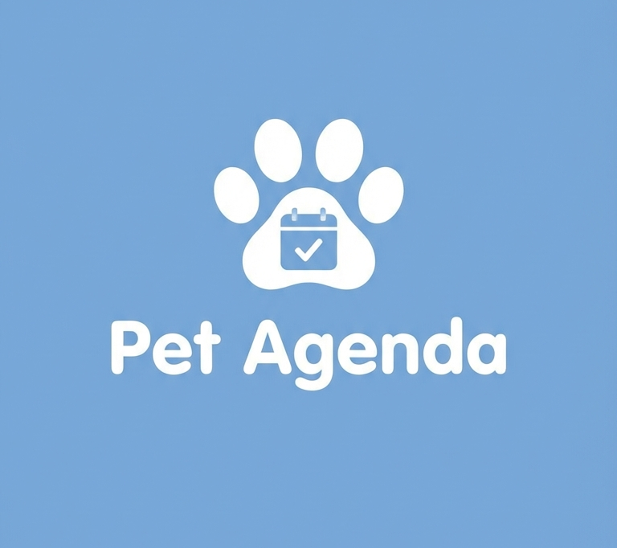

# Zupet

**O app para cuidar do seu pet com inteligência.**

Histórico de saúde, vacinas, lembretes, fotos e muito mais —
tudo em um só lugar, bonito e fácil de usar.

---

## 🐾 O que é o Zupet?

O Zupet nasceu da necessidade de ter **um lugar só** para guardar tudo sobre o seu pet. Sem cadernos perdidos, sem esquecer quando foi a última vacina, sem depender de memória para saber qual remédio o veterinário receitou.

Com o Zupet, o histórico completo do seu animal de estimação fica sempre no seu bolso — organizado, bonito e acessível até offline.

---

## ✨ Funcionalidades

**🏠 Meus Pets**
Cadastre todos os seus animais com foto, espécie, raça, data de nascimento, peso e informações de saúde. Cada pet tem seu próprio perfil completo.

**📋 Passaporte do Pet**
Um documento digital completo com vacinas, medicamentos, histórico de peso e diário — exportável em PDF para levar ao veterinário.

**📅 Agenda & Lembretes**
Crie lembretes para consultas, vacinas, banho e medicamentos com recorrência semanal, mensal ou trimestral. Nunca mais perca uma data importante.

**💉 Histórico de Vacinas**
Registre cada vacina com data de aplicação e próximo reforço. O app avisa quando chegar a hora.

**⚖️ Controle de Peso**
Acompanhe a evolução do peso ao longo do tempo com histórico detalhado.

**📸 Galeria de Fotos**
Um álbum dedicado para os momentos do seu pet. Porque toda foto deles merece ser guardada com carinho.

**🏆 Conquistas**
Sistema de conquistas que celebra cada passo da sua jornada como tutor — do primeiro pet à família grande.

**📍 Serviços Próximos**
Encontre veterinários, pet shops e clínicas perto de você.

**🌈 Memorial**
Quando um pet vai embora, seus dados são preservados com carinho como memória eterna.

---

## 📱 Telas

| Login | Meus Pets | Perfil do Pet | Passaporte |
|:---:|:---:|:---:|:---:|
|  |  |  |  |

| Agenda | Lembretes | Estatísticas | Conquistas |
|:---:|:---:|:---:|:---:|
|  |  |  |  |

---

## 🔒 Privacidade & Segurança

- Login com **Google** — sem senhas para lembrar
- Dados protegidos com criptografia e Row Level Security
- Funciona **100% offline** — seus dados ficam no dispositivo
- Sincronização automática quando conectado
- Nenhum dado de saúde é compartilhado com terceiros

---

## 🌐 Links

| | |
|---|---|
| 🌍 Site oficial | [zupet.io](https://zupet.io) |
| 📲 Google Play | [Download gratuito](https://play.google.com/store/apps/details?id=io.zupet.app) |
| 📜 Política de Privacidade | [zupet.io/privacidade](https://zupet.io/privacidade) |
| 📄 Termos de Uso | [zupet.io/termos](https://zupet.io/termos) |

---

Feito com 🐾 para todos os tutores que amam seus pets de verdade.

